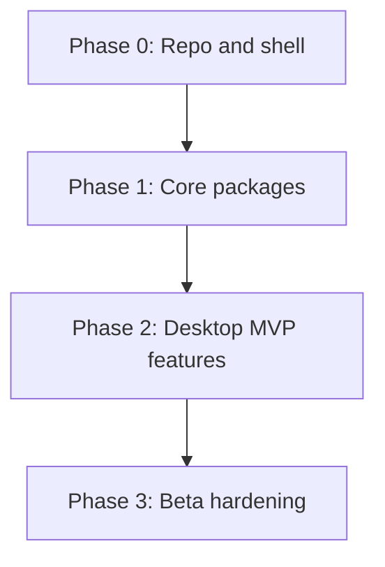

# CertTrace — Delivery Roadmap

> **Status:** Active — shipping **0.0.x** beta builds toward a stable **1.0**  
> **Last updated:** 2026-08-01  
> **Related:** [decisions.md](decisions.md), [phase-0-checklist.md](phase-0-checklist.md), [spec.md](spec.md), [release-runbook.md](release-runbook.md)

Phased delivery from planning docs through beta. The product is past scaffolding: installers and in-app updates ship on the `desktop-v0.0.x` line. Early planning called the first public milestone “v0.1”; that name maps to the current beta track, not a separate unreleased line. Stable **1.0.0** is the next named milestone (see release-runbook).



---

## Phase 0 — Repository, organization, bare minimum shell

**Goal:** Project exists in git, on GitHub, with CI/release skeleton and a minimal app window on macOS, Windows, and Linux.

**Deliverables:**

- Planning docs committed (this folder)
- Git repo initialized; MIT `LICENSE`, `.gitignore`, `README.md` (offline/no-telemetry pledge)
- GitHub repo under subtractmanufacturing org (`certtrace`)
- Branch protection on `main`
- Conventional Commits + release-please config
- CI workflow: lint, typecheck, test placeholders; build matrix (macOS, Windows, Linux)
- Minimal Tauri + React + Vite shell — window opens, shows scaffold message
- pnpm workspaces root (no feature packages yet)

**Exit criteria:**

- [x] `main` on GitHub with all planning docs
- [x] CI green on all three OS targets
- [x] Local dev: `pnpm dev` opens Tauri window
- [x] README documents setup, privacy stance, contributing (Conventional Commits)
- [x] release-please workflow merged

**Runbook:** [phase-0-checklist.md](phase-0-checklist.md) (historical)

---

## Phase 1 — Core packages

**Goal:** Business logic and storage work in tested packages; Rust handles perf/native concerns.

**Deliverables:**

```txt
packages/
  types/           # Shared TS types + JSON Schema validators
  id-generator/    # Template resolution, uniqueness
  file-storage/    # StorageProvider interface
  library-engine/  # Open/create library, CRUD, migrations
  core/            # Search index, label PDF generation
  ui/              # shadcn components (no Tauri imports)
apps/
  desktop/         # Tauri shell wiring commands to packages
```

- Vitest unit + integration tests
- Fixture libraries under `fixtures/libraries/` (empty, small, broken)
- Rust commands: filesystem I/O, file watch (`notify`), native dialogs
- App settings read/write in OS app-data paths (see [decisions.md](decisions.md))

**Exit criteria:**

- [x] Create/open library produces correct folder structure
- [x] Material CRUD round-trips to disk JSON
- [x] ID generator produces unique IDs for all shipped presets
- [x] Search index builds from library materials (fixture coverage in package tests)
- [x] Label PDF generates from material metadata + Label Templates
- [x] Schema migrator tests pass

---

## Phase 2 — Desktop MVP features

**Goal:** Full beta user workflow in the UI per [ui-direction.md](ui-direction.md) and [spec.md](spec.md) MVP (minus scanner).

**Features:**

| Feature | Notes |
|---------|-------|
| Startup / recent libraries | Per-machine app settings |
| Create library wizard | Includes ID + word-list setup |
| Materials list + search | Scoped to library or all libraries |
| Material detail | Metadata, attachments, preview |
| File attachments | Copy into material folder |
| Label export | PDF download / print via system dialog |
| File preview | PDF, PNG, JPG in-app |
| File watching | Refresh on external changes |
| Settings | Theme, updates preference, about/privacy |
| Cross-library search | When view = All libraries |

**Explicitly not in Phase 2:**

- USB/camera scanner (deferred)
- Server/web mode
- OCR

**Exit criteria:**

- [x] Core MVP flows available on macOS, Windows, and Linux builds
- [x] Manual smoke: create library → add material → attach cert → search → export/print label
- [x] Works offline; no network calls during core flows (optional update check only)
- [x] Component tests for critical UI paths

---

## Phase 3 — Beta hardening and release path to 1.0

**Goal:** Signed installers, auto-updates from GitHub Releases, and a proven ship path on **0.0.x** toward stable **1.0**.

**Deliverables:**

- Code signing (Apple notarization + Windows via SignPath or purchased cert)
- Tauri updater wired to GitHub Releases
- In-app "Update available" dialog
- Release workflow: release-please → tagged release → CI builds artifacts → publishes
- Manual QA checklist: network share library, large library (5k materials), Linux desktop environments
- CHANGELOG generated by release-please

**Exit criteria:**

- [x] Beta builds tagged and published on GitHub Releases (`desktop-v0.0.x`)
- [x] Installers for macOS, Windows, Linux
- [x] Updater successfully moves an installed build to a newer release (dry run verified 2026-07-31)
- [x] README install instructions for all three platforms
- [ ] No telemetry verified (network inspection optional in QA)

---

## Post-1.0 (future phases — not scheduled)

From [spec.md](spec.md) future roadmap:

- OCR / auto metadata extraction
- USB barcode scanner integration
- Audit export
- Customer/job linking
- Server mode + browser UI
- User permissions
- Mobile companion

Each gets its own planning doc and vertical slice plan before implementation.

---

## Estimated timeline (guidance only)

| Phase | Indicative duration |
|-------|---------------------|
| Phase 0 | 1 week |
| Phase 1 | 3–4 weeks |
| Phase 2 | 3–4 weeks |
| Phase 3 | 1–2 weeks |

Adjust based on available dev time. Phases overlap slightly at boundaries (e.g. start UI in late Phase 1).

---

## Revision history

| Date | Change |
|------|--------|
| 2026-05-28 | Initial roadmap Phases 0–3 |
| 2026-08-01 | Reconcile with shipped 0.0.x beta; mark Phases 0–2 largely complete |
