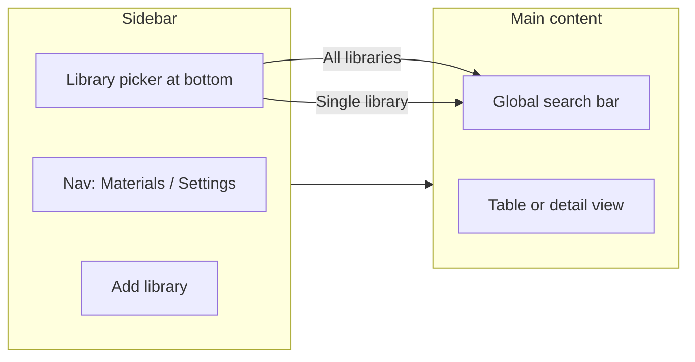

# CertTrace — UI Direction

> **Status:** Draft  
> **Last updated:** 2026-05-28  
> **Related:** [decisions.md](decisions.md), [spec.md](spec.md)

This document defines the visual and interaction north star for CertTrace. It constrains implementation; it does not replace the architecture spec.

---

## Design intent

CertTrace should feel like a **simple, professional desktop tool** — not a flashy SaaS product. Think:

- **Obsidian** — calm sidebar, content-first, minimal chrome
- **Stripe Dashboard** — clean tables, obvious hierarchy, neutral colors

Avoid bright gradients, heavy branding, or opinionated color themes. The app should disappear behind the user's data.

Existing HTML mockups in [`Mockups/`](Mockups/) are **layout reference only**. Do not copy their color palettes (especially the purple/pink gradients in mockup-14). Prefer the restrained tone of mockup-10 (minimal desktop) for density and spacing, combined with a sidebar layout.

---

## Component stack

| Layer | Choice |
|-------|--------|
| **Component library** | [shadcn/ui](https://ui.shadcn.com/) (copy-paste components, full control) |
| **Styling** | Tailwind CSS |
| **Icons** | Lucide (shadcn default) |
| **Theme** | Light default; dark mode via shadcn theme toggle in Settings |

### Color palette (neutral)

- Background: white / slate-50 (light), slate-950 (dark)
- Sidebar: slate-100 (light), slate-900 (dark)
- Text: slate-900 / slate-500 for muted
- Accent: single restrained color (e.g. slate-700 button, or subtle blue-600 for primary actions only)
- Borders: slate-200 / slate-800
- No gradients, no neon, no multi-color icon rails

---

## Layout model

### Sidebar (left, ~240px)

**Top — primary navigation**

- Materials (default view)
- Settings

Future nav items (post-v0.1) slot in here without restructuring.

**Bottom — library context (pinned)**

- Current library selector (dropdown or list)
  - Each recent/open library by name
  - **All libraries** — aggregates view and enables cross-library search
- **Add library** action (opens create-library wizard)
- Visual separator between nav and library picker

The library picker is the primary context switch. Changing library refilters the main table and scopes search (unless "All libraries" is selected).

### Main content area

**Top bar**

- Global search input (always visible on Materials view)
  - Placeholder reflects scope: "Search Main Shop…" vs "Search all libraries…"
  - Instant filter as user types
- Primary action button: **Add material** (or **New material**)

**Body**

- Default: sortable materials **table** (ID, material, supplier, heat, location, attachment indicator)
- Row click opens **detail panel** (right drawer or split pane — prefer drawer on smaller windows, split on wide)
- Empty state: short message + CTA to add first material or open a library

### Detail panel / drawer

Shows for selected material:

- Metadata fields (editable inline or via edit mode)
- Attachment list with preview thumbnails
- Label preview (QR + text fields from metadata)
- Actions: Edit, Add files, Remove files, Export label PDF, Open folder in Finder/Explorer

---

## Wizards (non-technical user flows)

Complex configuration uses **step-by-step wizards**, not raw JSON or code-like inputs.

| Wizard | Steps (high level) |
|--------|-------------------|
| **Create library** | Name → Choose folder → ID strategy (pick preset or custom) → Label template → Create |
| **ID template builder** | Name preset → Add word-list tokens → Add separators/literals → Preview samples → Save |
| **Word list editor** | Name category → Paste or add words one-by-one → Save (stored in library) |

Wizards use plain language labels ("Pick a word category", "Preview IDs") — never expose `{token}` syntax without a live preview and picker UI.

See [id-system.md](id-system.md) for data model behind these wizards.

---

## MVP screens

Each screen should be implementable as a route or view state without a separate visual identity.

| # | Screen | Purpose |
|---|--------|---------|
| 1 | **Startup / welcome** | Shown when no library is open. Recent libraries list, Open folder, Create library. |
| 2 | **Materials list** | Sidebar + search + table. Default working view. |
| 3 | **Material detail** | Drawer/panel from list selection. Metadata, attachments, label preview. |
| 4 | **Create library wizard** | Full-screen or modal wizard. |
| 5 | **ID template / word-list wizard** | Accessible from library settings and create-library flow. |
| 6 | **Settings** | Theme, update preferences, about/privacy statement, open app data folder. |
| 7 | **Update available dialog** | Modal: version number, release notes snippet, Update now / Later. |

---

## Interaction principles

1. **Search-first** — Users find materials by typing; table filters instantly.
2. **Filesystem transparent** — "Open folder" always available; never hide files from the user.
3. **Obvious state** — Current library name visible in sidebar bottom; "All libraries" clearly distinct.
4. **Keyboard friendly** — Focus search with `/` or `Cmd/Ctrl+K` (implement in Phase 2).
5. **No network indicators** — App never implies connectivity is required.

---

## Out of scope for UI v0.1

- Scanner-driven search autofocus
- Camera / QR scan from webcam
- Custom themes beyond light/dark
- Dashboard charts or analytics widgets

---

## Revision history

| Date | Change |
|------|--------|
| 2026-05-28 | Initial direction: shadcn sidebar, neutral palette, library picker at bottom |
